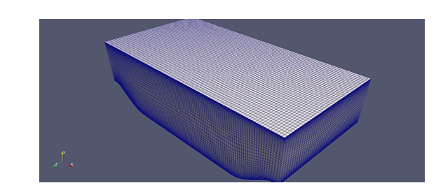
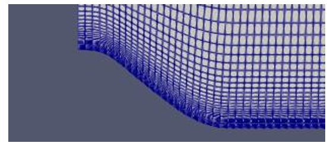
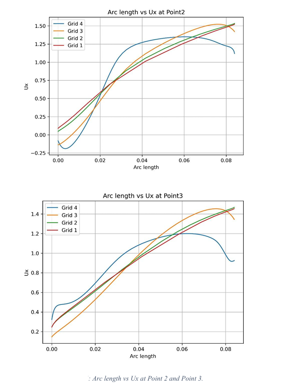
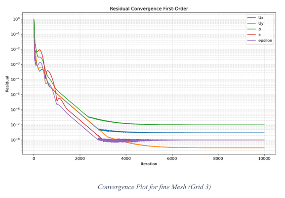
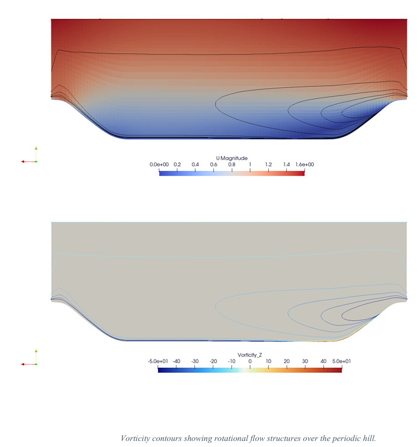
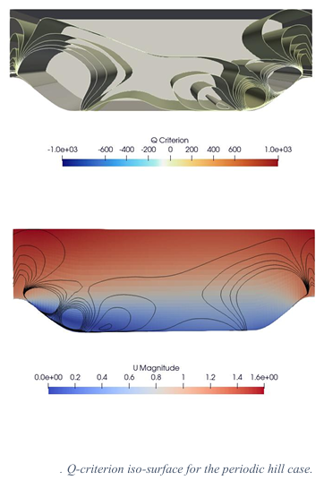
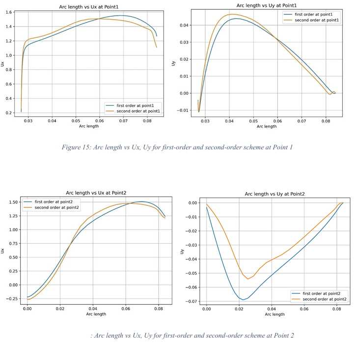

# Flow Over a Periodic Hill — OpenFOAM CFD Study

A three-dimensional steady-state CFD study of turbulent flow over a periodic hill using **OpenFOAM**, with emphasis on **grid independence, numerical convergence, discretization schemes, solver sensitivity, and flow-field visualization**.

The study investigates how mesh resolution and numerical settings influence the stability and predicted flow behavior of a periodic-hill benchmark case.

> **Project type:** University team project  
> **Primary tools:** OpenFOAM, ParaView  
> **Methods:** RANS CFD, structured meshing, grid-independence study, numerical-scheme comparison, solver sensitivity analysis

---

## CFD Overview



The computational domain represents turbulent flow over a periodically repeating hill. The case was modeled as a three-dimensional, steady-state, incompressible RANS simulation.

A structured hexahedral mesh was generated using OpenFOAM `blockMesh`, with mesh refinement toward the hill surface to resolve stronger near-wall velocity gradients.

### Mesh Detail



---

## Grid Independence Study

Four structured mesh resolutions were investigated:

| Grid | Cells |
|---|---:|
| Grid 1 | 5,000 |
| Grid 2 | 40,000 |
| Grid 3 | 320,000 |
| Grid 4 | 2,560,000 |

Streamwise velocity profiles were compared at downstream sampling locations to evaluate mesh sensitivity.



The coarse meshes showed stronger mesh sensitivity, while **Grid 3 and Grid 4 produced closely agreeing velocity profiles** over most of the sampled region.

Because Grid 4 required substantially greater computational resolution while providing only marginal improvement in the reported velocity comparison, **Grid 3 was selected for the remaining analysis**.

---

## Convergence Analysis

Residual histories were monitored to evaluate numerical convergence.



The residual histories show a strong initial decrease followed by stabilization at low residual levels, supporting the convergence assessment used in the study.

---

## Flow-Field Analysis

### Vorticity

Vorticity was examined to identify rotational flow structures and regions associated with separation and reattachment.



The reported results show strong rotational behavior near the hill surface and downstream region, providing additional insight into the separated flow structure.

### Q-Criterion

Q-criterion visualization was used as a post-processing method for identifying vortex-dominated regions.



The visualization highlights vortical structures associated with the flow over the periodic hill and complements the velocity and vorticity analysis.

---

## Numerical-Scheme Comparison

The study compared:

- First-order upwind discretization
- Second-order linear discretization



The first-order scheme produced smoother convergence behavior but showed greater numerical diffusion.

The second-order scheme produced sharper velocity variations and was preferred in the project study for detailed flow analysis.

---

## Solver Sensitivity Studies

In addition to mesh refinement and discretization schemes, the project investigated the influence of:

- Linear-solver tolerances
- Relaxation factors
- Non-orthogonal correctors
- Residual-control settings

These studies were used to examine the relationship between **numerical stability, convergence behavior, computational effort, and predicted flow quantities**.

---

## OpenFOAM Case

A retained OpenFOAM case configuration is included under [`case/`](case/).

```text
case/
├── 0/
│   ├── U
│   ├── p
│   ├── k
│   ├── epsilon
│   └── nut
├── constant/
│   ├── transportProperties
│   └── turbulenceProperties
└── system/
    ├── blockMeshDict
    ├── controlDict
    ├── decomposeParDict
    ├── fvOptions
    ├── fvSchemes
    ├── fvSolution
    └── topoSetDict
```

The retained configuration uses a **320,000-cell structured mesh**, corresponding to Grid 3 of the mesh study.

Because several numerical configurations were investigated during the project, this retained case should **not** be interpreted as a complete archive of every sensitivity-study configuration.

---

## Repository Structure

```text
periodic-hill-cfd-openfoam/
├── README.md
├── case/
│   ├── 0/
│   ├── constant/
│   └── system/
├── images/
│   ├── periodic_hill_domain_mesh.png
│   ├── periodic_hill_mesh_closeup.png
│   ├── grid_independence_ux.png
│   ├── grid3_convergence.png
│   ├── vorticity_contours.png
│   ├── q_criterion.png
│   └── numerical_scheme_comparison.png
├── results/
│   └── README.md
└── docs/
    └── README.md
```

---

## Tools and Techniques

**CFD**
- OpenFOAM
- Steady-state incompressible RANS
- SIMPLE-based solution procedure
- Structured hexahedral meshing
- `blockMesh`

**Post-Processing**
- ParaView
- Velocity-field visualization
- Vorticity visualization
- Q-criterion visualization
- Velocity-profile comparison
- Residual analysis

**Numerical Analysis**
- Grid-independence study
- Discretization-scheme comparison
- Solver-tolerance sensitivity
- Relaxation-factor sensitivity
- Non-orthogonal-corrector study

---

## Project Scope and Attribution

This work was completed as a **three-person university team project**.

The retained project evidence does not separately document each team member's individual contribution. Therefore, this repository presents the work as a team project rather than assigning specific tasks to individual members.

The original academic report is intentionally not included because it contains student identification numbers and academic administrative information.

The report states that Python was used for plotting during the project; however, retained plotting source code is not available and therefore no Python scripts are presented in this repository.

---

## Repository Notes

Large generated OpenFOAM time directories, decomposed `processor*` directories, redundant intermediate simulation data, and the original academic report are intentionally excluded.

The repository focuses on the **case configuration, numerical methodology, selected engineering results, and CFD interpretation**.
